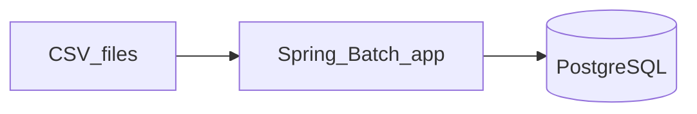

# C4 — контейнеры с Spring Batch (POC)

```mermaid
flowchart LR
  csv[CSV_files]
  batch[Spring_Batch_app]
  pg[(PostgreSQL)]
  csv --> batch
  batch --> pg
```

Поток: `product-data.csv` и справочник `loyality_data` в БД → обработка чанками → таблица `products`.
